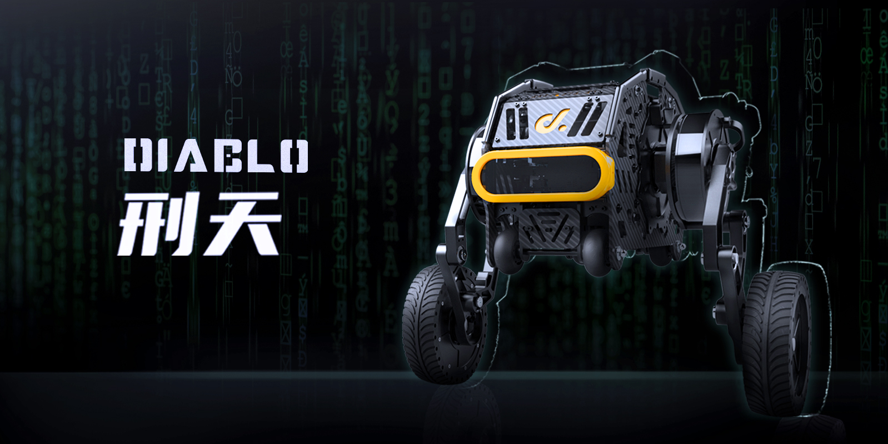

> # 欢迎使用 DIABLO-Development-Doc 开发文档!
>

```{toctree}
:maxdepth: 1
:caption: DIABLO-Development-Doc 开发文档
pages/Installation
pages/Node-List
pages/Related-Projects
```


## 简介



为了提供给您更加多样的选择，我们提供了三种开发方式。您可以直接使用 Ros 、Ros2 、或者是直接编译 SDK 的源码进行机器人的二次开发工作。我们更加推荐您使用 `Ros2` 的版本进行开发，它具有更好的性能，更加稳定的控制方法。

我们也将在后续不断的提供更多的 Ros2 功能包，帮助您快速获得各种功能，希望这能对您自定义自己的专属机器人提供一些帮助。

* 兼容性优秀：软件设计上对环境依赖少，您几乎可以在大部分的支持串口的 `Linux` 设备中进行使用。

* 控制界面简单：我们在 `Ros2` 的功能包中提供了 `rviz2` 和 `gazebo` 的机器人可视化功能，并且可以使用自定义遥控器插件进行控制。

* 安全性好：系统配套了多种安全保障逻辑，可以在用户开发过程中各种特殊工况下，尽可能保证安全。

您可以在我们的官网获得更多的产品信息 [本末科技](https://directdrive.com)。

### 如何开始

您可以通过一下的三种方法对我们的 `SDK` 进行编译。

- [在 Ros2 中编译功能包 (Recommended)](./pages/Installation/installing-ros2-packages)
- [在 Ros 中编译功能包](./pages/Installation/installing-ros-packages)
- [使用 C++ 源码进行编译](./pages/Installation/build-without-ros)

### SDK开发案例

我们为您提供了一个键盘事件捕获的 `Python` 控制节点。您可以在启动 `diablo_ctrl_node` 获得 `SDK` 的控制权限之后，运行 `teleop_node` 捕获键盘中的事件，您可以参考其指令的使用方法。


```{note}
  我们将致力于为您提供更多优质的机器人控制服务，依托于我们的机器人平台适配更多的智能算法，希望这能对您的研发工作有所帮助。
```

