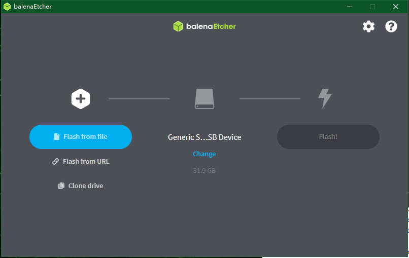

# Tutorial for flashing the OS image

```{toctree}
:maxdepth: 1
:glob:
```

```{contents} Contents
:depth: 2
:local:
```

## Install balenaEtcher and start it on Windows

- You can download and install the software from the official website of [balenaEtcher](https://www.balena.io/etcher/).
- Click Flash from file to select the image file.


## Insert SD card into PC



- Select SD card.
- Click Flash! to start flashing the image.
- Wait for it to finish.