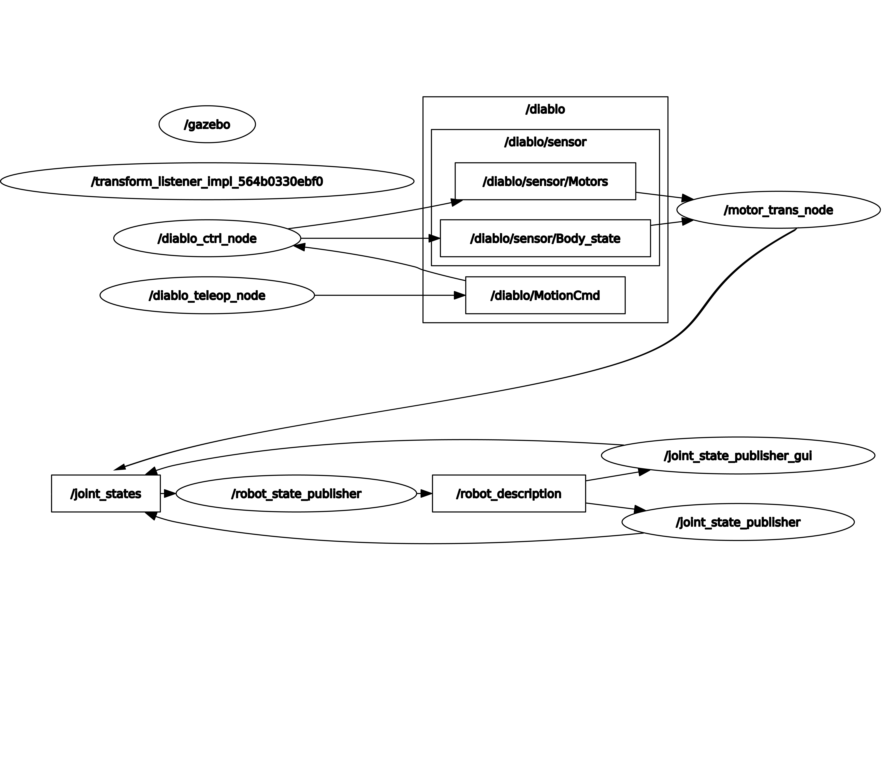

# ROS2 Node List

```{toctree}
:maxdepth: 3
:hidden:
:glob:

Node-list/Robot-ception
Node-list/Robot-common
Node-list/Robot-interaction
Node-list/Robot-interfaces
Node-list/Robot-visualise
```

You can refer to the examples provided on this page for your customized development.

* [Robot sensing](./Node-list/Robot-ception.md)

* [General functions of robot](./Node-list/Robot-common.md)

* [Robot basic control](./Node-list/Robot-interaction.md)

* [Customized interface of robot](./Node-list/Robot-interfaces.md)

* [Visualization module of robot](./Node-list/Robot-visualise.md)

## Invoking relationships among functions

