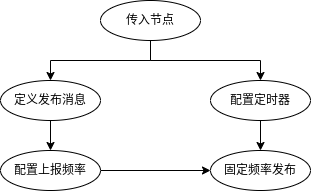

# 机器人内置传感器

```{toctree}
:maxdepth: 2
:glob:
```

在此功能包中，我们定义了四种传感器数据的发布方式。由于机载传感器的数据是通过串口的形式发送到 `Pi` 中的，所以在此处定义的发布方法都是将 `diablo_ctrl_node` 的指针作为参数，进行数据的发布，并没有创建新的 ``node`` 。因此，文件中的构建的方法都需要在 `diablo_ctrl.cpp` 中进行调用才会工作。

- 机器人电池信息 : `1Hz`
- 机器人状态信息 : `10Hz`
- 机器人陀螺仪信息 : `50Hz`
- 机器人关节电机信息 : `10Hz`

## 调用关系




```{warning}
由于串口的带宽有限，将电机信息的频率调整过高，有可能会对其他数据包产生影响。
```


