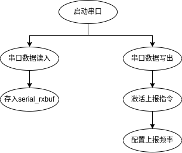

# 机器人SDK实现

```{toctree}
:maxdepth: 2
:glob:
```


- onboard_sdk_uart_protocol.h-------------->通信协议结构体定义
- osdk_crc.hpp-------------------------------------->数据crc校验
- osdk_ddj_m15.hpp------------------------------>m15 电机控制协议
- osdk_hal.hpp-------------------------------------->串口读写操作实现
- osdk_header.hpp-------------------------------->通信协议包头定义及处理
- osdk_movement.hpp--------------------------->机器人控制方法实现
- osdk_telemetry.hpp----------------------------->串口数据解包实现
- osdk_vehicle.hpp--------------------------------->整合调用接口
- osdk_virtual_rc.hpp------------------------------>模拟遥控器发送数据

## 调用关系



