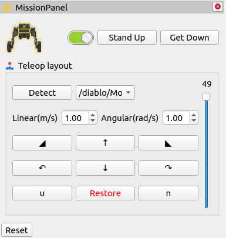

# 机器人Rviz2自定义插件

```{toctree}
:maxdepth: 2
:glob:
```

在此功能包中，我们利用 `Qt` 为 `Rviz2` 进行了遥控器可视化插件的制作。您也可以参照此例程对其控制逻辑进行修改，或者自定义一些数据的可视化插件，这可能需要您对 `Qt` 有一些了解。

## 插件预览



## 快速开始

请确保您已经成功编译了 `diablo_rviz2_plugin` 节点。

> - Panels -> Add new panel -> mission panel

使用前您需要在 `机器人端` 启动  `diablo_ctrl_node` 获取机器人的控制权限。并点击 `Detect` 搜索 `/diablo/MotionCmd` 以建立控制连接。

您可以通过拖动右侧 `滑动条` 控制机器人站立高度。调整窗口数值，以改变机器人控制速度。您可以通过鼠标点击 Ui 按钮实现控制。也可以将鼠标悬停至该组件上，使用键盘进行控制。

|   q(左侧倾斜)   |        w(前进)        |   e(右侧倾斜)   |
| :-------------: | :-------------------: | :-------------: |
|     a(左转)     |        s(后退)        |     d(右转)     |
| z(固定速度仰头) | x(停止仰头或停止倾斜) | c(固定速度低头) |


## 致谢

- 	[Cyberdog_rviz2_plugin](https://github.com/linzhibo/Cyberdog_rviz2_plugin)

