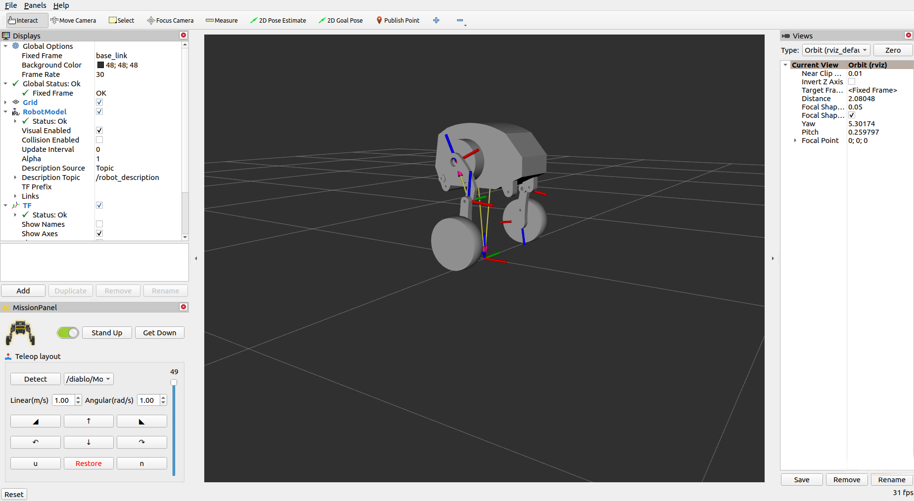
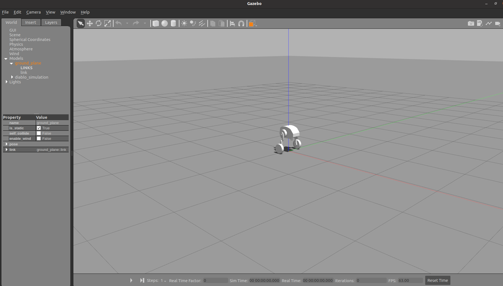

# Simulation components of robot

```{toctree}
:maxdepth: 2
:glob:
```

We provide the robot data visualization process of `rviz`, and a custom remote control plug-in in this module. Launching the `launch` file we provide can start these functions. You can use the multi-machine communication mechanism of `Ros2` to start `diablo_ctrl_node` on `Robot` side and take control of the robot. Start `ctrl.launch.py` on `PC` terminal in the local area network to control the robot remotely and monitor the data feedback.

## Quick start

Make sure you have successfully compiled the content in `diablo_visualise`.

```bash
ros2 launch diablo_simulation ctrl.launch.py
```

> Note: You need to close `joint state publisher` UI manually after startup. Otherwise your numerical display will be affected.



## Simulation design

We also support `gazebo` startup in the routine procedures. If your development skills are strong, you can create your own balancing algorithm for the robot and carry out the follow-up motion simulation work. If you have designed an excellent control program, you are welcome to contact us. We will reward you based on the completeness of your work.

```
ros2 launch diablo_simulation gazebo.launch.py
```

Please start your show~

